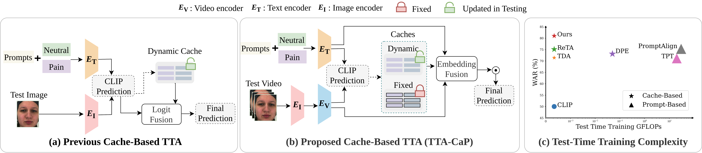
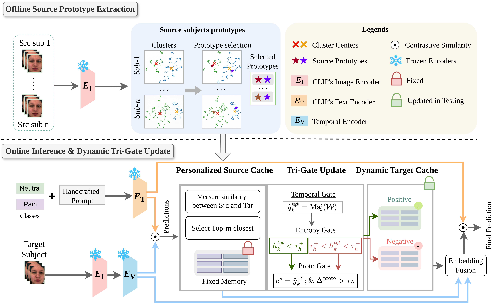

# Test-Time Adaptation via Cache Personalization for Facial Expression Recognition in Videos (ECCV2026).

by
**Masoumeh Sharafi<sup>1</sup>,
Muhammad Osama Zeeshan<sup>1</sup>,
Soufiane Belharbi<sup>1</sup>,
Alessandro Lameiras Koerich<sup>2</sup>,
Marco Pedersoli<sup>1</sup>,
Eric Granger<sup>1</sup>**

<sup>1</sup> LIVIA, Dept. of Systems Engineering, ÉTS, Montreal, Canada
<br/>
<sup>2</sup> LIVIA, Dept. of Software and IT Engineering, ÉTS, Montreal, Canada
<br/>

<p align="center">
<p align="center">


## Abstract
Facial expression recognition (FER) in videos requires model personalization to capture the considerable variations across subjects. Vision-language models (VLMs) offer strong transfer to downstream tasks through image-text alignment, but their performance can still degrade under inter-subject distribution shifts. Personalizing models using test-time adaptation (TTA) methods can mitigate this challenge. However, most state-of-the-art TTA methods rely on unsupervised parameter optimization, introducing computational overhead that is impractical in many real-world applications. This paper introduces TTA through Cache Personalization (TTA-CaP), a cache-based TTA method that enables cost-effective (gradient-free) personalization of VLMs for video FER. Prior cache-based TTA methods rely solely on dynamic memories that store test samples, which can accumulate errors and drift due to noisy pseudo-labels. TTA-CaP leverages three coordinated caches -- a personalized source cache that stores source-domain prototypes, a positive target cache that accumulates reliable subject-specific samples, and a negative target cache that stores low-confidence cases as negative samples to reduce the impact of noisy pseudo-labels. Cache updates and replacement are controlled by a tri-gate mechanism based on temporal stability, confidence, and consistency with the personalized cache. Finally, TTA-CaP refines predictions through fusion of embeddings, yielding refined representations that support temporally stable video-level predictions. Our experiments on three challenging video FER datasets — BioVid, StressID, and BAH — indicate that TTA-Cap can outperform state-of-the-art TTA methods under subject-specific and environmental shifts, while maintaining low computational and memory overhead for real-world deployment.

## Main Contributions

Our main contributions are:

- A cache-based, gradient-free TTA method, \ours, that couples target caches with a personalized source cache built from source subject prototypes to mitigate noisy pseudo-label updates and improve personalized video FER.

- A tri-gate cache update mechanism together with an embedding-level fusion strategy that combines CLIP visual features with cache-retrieved representations for more reliable predictions during TTA.

- Extensive evaluation on three challenging video FER benchmarks—BioVid (pain estimation), StressID (stress recognition), and BAH (ambivalence-hesitancy recognition)—showing that TTA-CaP outperforms state-of-the-art prompt-tuning and cache-based baselines.

## Citation:
```sh
@article{sharafi2026test,
  title={Test-Time Adaptation via Cache Personalization for Facial Expression Recognition in Videos},
  author={Sharafi, Masoumeh and Zeeshan, Muhammad Osama and Belharbi, Soufiane and Koerich, Alessandro Lameiras and Pedersoli, Marco and Granger, Eric},
  journal={arXiv preprint arXiv:2603.21309},
  year={2026}
}
```

```sh
@article{gonzalez-26-ah-digital,
  title={Ambivalence/Hesitancy Recognition in Videos for Personalized Digital Health Interventions},
  author={González-González, M. and  Belharbi, S. and Zeeshan, M.O. and Sharafi, M. and Aslam, M.H. and Sia, L. and Richet, N. and Pedersoli, M. and Koerich, A.L. and Bacon, S.L. and Granger, E.},
  journal={CoRR},
  volume={abs/2604.11730},
  year={2026}
}
```

## Installation

Clone the repository:

```bash
git clone https://github.com/MasoumehSharafi/TTA-CaP.git
cd TTA-CaP
```

Install dependencies:

```bash
pip install -r requirements.txt
```

## Datasets
```sh
Biovid: https://www.nit.ovgu.de/BioVid.html#PubACII17
StressID: https://project.inria.fr/stressid/
BAH: https://www.crhscm.ca/redcap/surveys/?s=LDMDDJR3AT9P37JY
Aff-Wild2: https://sites.google.com/view/dimitrioskollias/databases/aff-wild2
```


## Personalizes Source Cache Construction
```sh
bash run_build_protos.sh
```
## Online TTA
```sh
bash ./scripts/biovid_run_online_tta.sh
```
