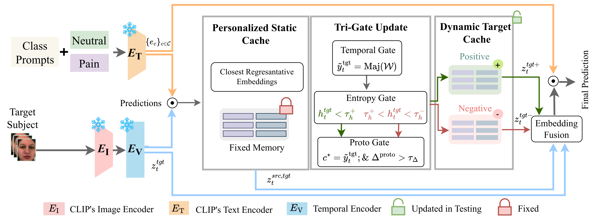

# Test-Time Adaptation via Cache Personalization for Facial Expression Recognition in Videos.

by
**Masoumeh Sharafi<sup>1</sup>,
Muhammad Osama Zeeshan<sup>1</sup>,
Soufiane Belharbi<sup>1</sup>,
Alessandro Lameiras Koerich<sup>2</sup>,
Marco Pedersoli<sup>1</sup>,
Eric Granger<sup>1</sup>**

<sup>1</sup> LIVIA, Dept. of Systems Engineering, ÉTS, Montreal, Canada
<br/>
<sup>2</sup> LIVIA, Dept. of Software and IT Engineering, ÉTS, Montreal, Canada

<p align="center">
<p align="center">

[](https://arxiv.org/pdf/2603.21309)

## Abstract
Facial expression recognition (FER) in videos requires model personalization to capture the considerable variations across subjects. Vision-language models (VLMs) offer strong transfer to downstream tasks through image-text alignment, but their performance can still degrade under inter-subject distribution shifts. Personalizing models using test-time adaptation (TTA) methods can mitigate this challenge. However, most state-of-the-art TTA methods rely on unsupervised parameter optimization, introducing computational overhead that is impractical in many real-world applications. This paper introduces TTA through Cache Personalization (TTA-CaP), a cache-based TTA method that enables cost-effective (gradient-free) personalization of VLMs for video FER. Prior cache-based TTA methods rely solely on dynamic memories that store test samples, which can accumulate errors and drift due to noisy pseudo-labels. To address this limitation, TTA-CaP introduces three complementary caches -- a personalized static cache constructed through feature-statistics matching, a positive target cache that accumulates reliable subject-specific samples, and a negative target cache that stores low-confidence cases as negative samples. To prevent target-cache corruption, a tri-gate mechanism controls cache updates based on temporal stability, confidence, and consistency with the personalized static cache. Together, the caches provide complementary, subject-matched positive and negative evidence for robust personalization. Finally, TTA-CaP refines predictions by fusing embeddings, yielding representations that support temporally stable video-level predictions. Our experiments on three challenging video FER datasets — BioVid, StressID, and BAH — indicate that TTA-CaP can outperform state-of-the-art TTA methods under subject-specific and environmental shifts, while maintaining low computational and memory overhead for real-world deployment.

## Citation:
```
@article{sharafi26tta-cap,
  title={Test-Time Adaptation via Cache Personalization for Facial Expression Recognition in Videos},
  author={Sharafi, M. and Zeeshan, M.O. and Belharbi, S. and Koerich, A.L. and Pedersoli, M. and Granger, E.},
  journal ={CoRR},
  volume={abs/2603.21309},
  year={2026}
}
```

## Installation

Clone the repository:

```bash
git clone https://github.com/MasoumehSharafi/TTA-CaP.git
cd TTA-CaP
```

Install dependencies:

```bash
pip install -r requirements.txt
```

## Datasets
```sh
Biovid: https://www.nit.ovgu.de/BioVid.html#PubACII17
StressID: https://project.inria.fr/stressid/
BAH: https://www.crhscm.ca/redcap/surveys/?s=LDMDDJR3AT9P37JY
Aff-Wild2: https://sites.google.com/view/dimitrioskollias/databases/aff-wild2
```


## Personalizes Source Cache Construction
```sh
bash run_build_protos.sh
```
## Online TTA
```sh
bash ./scripts/biovid_run_tta.sh
```
